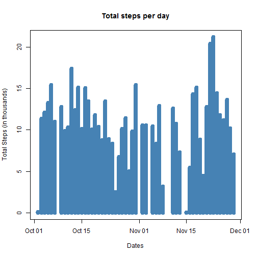
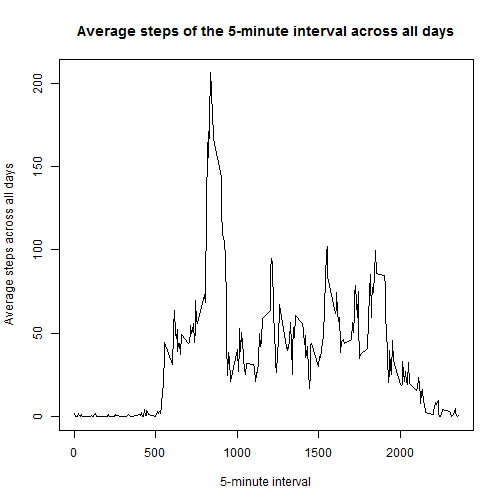
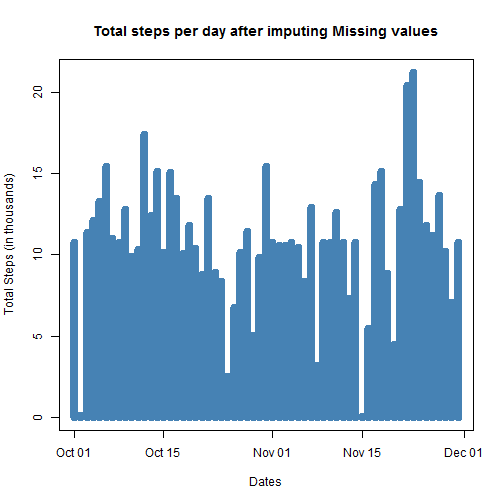
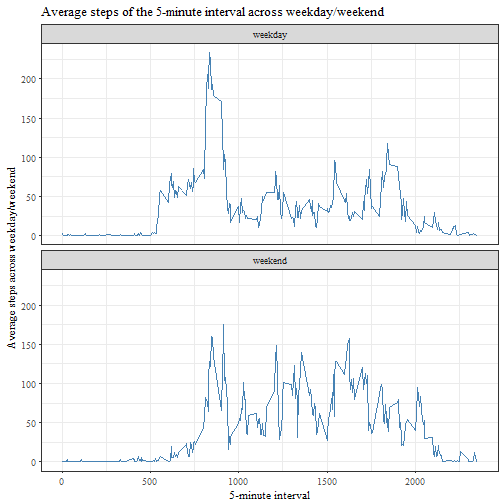

* ###Loading and preprocessing the data


```r
read.activity.full <- read.csv("./Coursera/activity.csv")
read.activity.full$date <- as.Date(as.character(read.activity.full$date), "%Y-%m-%d")
str(read.activity.full)
```

```
## 'data.frame':	17568 obs. of  3 variables:
##  $ steps   : int  NA NA NA NA NA NA NA NA NA NA ...
##  $ date    : Date, format: "2012-10-01" "2012-10-01" ...
##  $ interval: int  0 5 10 15 20 25 30 35 40 45 ...
```

* ###Total Number of Steps taken per day


```r
read.activity <- read.activity.full[!(is.na(read.activity.full$steps)),]
Total.Steps <- read.activity %>% group_by(date) %>% summarise(Total_Steps= sum(steps))
with(Total.Steps, plot(date, Total_Steps/1000, type = "h", lwd = 8, col = "steel blue", main = "Total steps per day", xlab = "Dates", ylab = "Total Steps (in thousands)"))
```



Calculating the Mean and Median of total number of steps taken per day


```r
Mean.Steps <- format(mean(Total.Steps$Total_Steps), scientific = FALSE)
Median.Steps <- median(Total.Steps$Total_Steps)
```

The Mean and Median of the total number of steps taken per day are **10766.19** and **10765** respectively


* ###Average Daily Activity Pattern


```r
Average.Steps <- read.activity %>% group_by(interval) %>% summarise(Average_Steps= mean(steps))
with(Average.Steps, plot(interval, Average_Steps, type = "l", main = "Average steps of the 5-minute interval across all days", xlab = "5-minute interval", ylab = "Average steps across all days"))
```



Computing 5-minute interval containing maximum number of steps, on average across all the days in the dataset


```r
Max.Steps <- Average.Steps[Average.Steps$Average_Steps == max(Average.Steps$Average_Steps), ]
```

**835th** interval contains maximum number of steps averaged across all days. 

* ###Imputing missing values


```r
activity.missing <- read.activity.full[(is.na(read.activity.full$steps)),]
```

Total number of missing values in the dataset is **2304**

Strategy to impute missing values:

* A dataframe is created with three columns: Unique interval, Average steps for each interval(calculated above) and count of the missing steps for that interval.

* Using this dataframe, a new data frame is created with three columns:

    1. Interval - Each interval is replicated to the count of the missing steps for        that interval.
    2. missing_steps - This is the random value for each interval 
       having the size equal to to the count of the missing steps for that interval        and mean equal to average steps for that interval.
    3. Sequence No. - A unique sequence number for each random value in a particular        interval.
    
* This new dataframe is then joined with the existing dataset activity.missing(created above) having the missing activity data to get the dates for each interval.Unnecessary columns are removed from this dataset.
    
* Finally, this dataset is row bind with the non-missing acivity dataset to form the complete dataset
    
    

```r
activity.missing.dataset <- data.frame()
Missing.steps <- activity.missing %>% group_by(interval) %>% summarise(Missing_Steps= length(steps)) %>% inner_join(Average.Steps, by = "interval") 
Missing.steps <- as.data.frame(Missing.steps)
for(i in 1:nrow(Missing.steps))
{
    x <- rnorm(Missing.steps[i,2], mean = Missing.steps[i,3])
    y <- replicate(Missing.steps[i,2], Missing.steps[i,1])
    z <- seq(1, Missing.steps[i,2])
    activity.missing.dataset <- rbind(activity.missing.dataset, cbind(y,x,z))
}
activity.missing <- activity.missing %>% group_by(interval) %>% mutate(Sequence.No = row_number())
activity.missing.dataset[,2] <- round(activity.missing.dataset[,2])
colnames(activity.missing.dataset) <- c("interval", "missing_steps","Sequence.No")
Merge.dataset <- activity.missing %>% inner_join(activity.missing.dataset, by =c("interval","Sequence.No")) 
Merge.dataset$steps <- Merge.dataset$missing_steps
Merge.dataset$missing_steps <- NULL
Merge.dataset$Sequence.No <- NULL
Merge.dataset <- as.data.frame(Merge.dataset)
read.activity.full <- rbind(read.activity, Merge.dataset)
Total.Steps.full <- read.activity.full %>% group_by(date) %>% summarise(Total_Steps= sum(steps))
with(Total.Steps.full, plot(date, Total_Steps/1000, type = "h", lwd = 8, col = "steel blue", main = "Total steps per day after imputing Missing values", xlab = "Dates", ylab = "Total Steps (in thousands)"))
```



Calculating the Mean and Median of total number of steps taken per day after imputing Missing Values


```r
Mean.Steps.full <- format(mean(Total.Steps.full$Total_Steps), scientific = FALSE)
Median.Steps.full <- format(median(Total.Steps.full$Total_Steps), scientific = FALSE)
```

The Mean and Median of the total number of steps taken per day are **10765.89** and **10763** respectively

The Mean and Median differs with its previous value by **-0.3** and **-2** respectively

* ###Activity patterns between weekdays and weekend


```r
read.activity$week <- weekdays(read.activity$date, abbreviate = TRUE)
read.activity$week[read.activity$week %in% c("Sat", "Sun")] <- "weekend"
read.activity$week[read.activity$week %in% c("Tue", "Wed", "Thu", "Fri","Mon")] <- "weekday"
Average.Steps.Week <- read.activity %>% group_by(interval, week) %>% summarise(Average_Steps= mean(steps))
g <- ggplot(Average.Steps.Week, aes(interval, Average_Steps))
g + geom_line(col = "steel blue") + facet_wrap(~factor(week), nrow = 2 , ncol = 1) + labs(title = "Average steps of the 5-minute interval across weekday/weekend", x = "5-minute interval", y = "Average steps across weekday/weekend") + theme_bw(base_size = 11, base_family = "Times")
```


